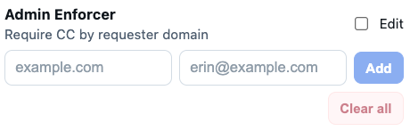
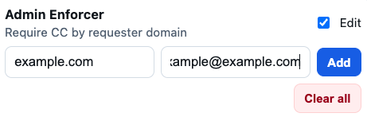
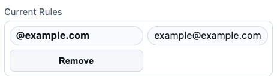

# Admin Enforcer

Admin Enforcer is a Zendesk app designed to enforce domain based administrative oversight on ticket saves.  
It ensures that tickets from specific customer domains cannot be saved unless a designated admin is included.

The app was built to address a real operational problem: tickets being updated without requested administrative visibility.

---

## What the App Does

Admin Enforcer allows teams to define **domain → required admin email** rules and enforces them automatically at save time.

### Core behavior
- When a ticket is saved, the app checks the requester's email domain
- If the domain has an enforcement rule:
  - The required admin **must be CC’d**
  - Otherwise, the save is blocked with a clear error message
- If the requester *is* the required admin, enforcement is skipped

---

## Features

### Rule Management
- Define rules that map:
  - **Customer email domain** → **Required admin email**
- Rules are:
  - Stored in Zendesk App Storage (team-wide)
  - Automatically fall back to local storage for local development

### Safe Edit Mode
- Rules can only be modified when **Edit Mode** is enabled
- Prevents accidental changes during normal use
- Includes a confirmation step for rule deletion

### Enforcement on Save
- Enforcement runs automatically on `ticket.save`
- Clear, user-facing error message when enforcement fails
- Non-blocking when no rule exists for a domain

---

## Displayed Information

The app UI displays:
- Enforced domains (e.g. `@example.com`)
- Required admin email for each domain
- Edit toggle to enable or disable rule management
- Add and remove controls (only active in edit mode)

---

## Example Enforcement Logic

- Ticket requester: `user@example.com`
- Rule exists: `example.com → admin@example.com`

✅ Allowed:
- Admin is CC’d  
- Admin is the requester  

❌ Blocked:
- Admin is not CC’d  

User sees:
> “Admin admin@example.com must be CC’d before saving (for @example.com).”

---

## Technical Overview

- **Platform:** Zendesk App Framework (ZAF)
- **Language:** JavaScript
- **Storage:**
  - Zendesk App Storage (primary)
  - LocalStorage fallback for local development
- **Events Used:**
  - `ticket.save`
  - `app.registered`

---

## Installation & Usage

1. Install the app in Zendesk
2. Open the app sidebar
3. Enable **Edit Mode**
4. Add one or more domain → admin rules
5. Disable Edit Mode to lock rules
6. Enforcement runs automatically on ticket save

---

## Intended Use

This app is designed for support teams and organizations that require administrative oversight for specific customer domains.  
It is generic and reusable across Zendesk environments where domain based enforcement is needed.

---

## Screenshots

### Default View
The app in its normal state with Edit Mode disabled. Existing domain rules are visible, but protected from accidental modification.

---

### Edit Mode Enabled
Edit Mode enables rule creation and removal. Safeguards prevent unintended changes during normal ticket handling.

---

### Current Rules
An example domain enforcement rule showing the required admin email that must be CC’d before a ticket can be saved.

---

## Development Notes

- Domain input is normalized (lowercase, no leading `@`)
- Admin email validation is enforced at input time
- Rules are sorted alphabetically for clarity
- Defensive storage handling ensures the app continues to function in local development environments

---

## License

This project is licensed under the MIT License.

---

## Author

Built by **Mike Lofgren**
